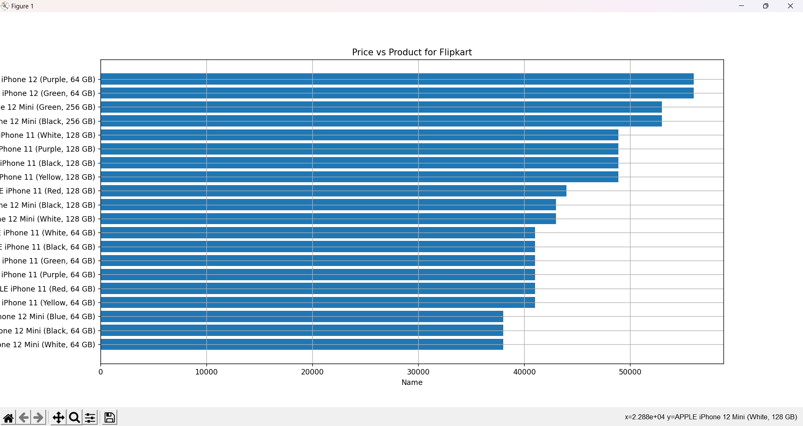

# B9AI108 Programming for Data Analysis  

## CA 2  

## Primary objective: To design and develop a Data Acquisition and Preprocessing Pipeline. 

 

 

 
 

Data Aquisition pipeline is used to collect a data from certain point and then apply preprocessing to it to get valuable information from it. There are various techniques for data gathering like API, web Scrapping, Database Extraction. In this Assignment web scrapping is used for data extraction; web scrapping along with json and beautifulSoup is used.  

 
 

  

 
 

In this Assignment, data is Scrapped from 3 websites for collection of iPhone price along with their rating. Initially the user is asked to select the website from which data needs to be extracted. After selection of website, depending on the website data is extracted i.e., for Flipart.com and Amazon.in whole html page is downloaded and passed through beautifulSoup and this data is filtered to select only required data. This data is converted into pandas data-frame and using matplotlib graph is plotted. For croma.com instead of using beautifulSoup json is used to collect the data. After filtering the required data, the same process is followed for data visualization.  

 
 

## Code Explanation 

 
 

There are three python files; One for each website. A main.py file is created that will be executed to run the project. All three classes named after the website is imported into the file. One object of each class is created and a while loop is started. Inside the loop user will be asked to select the website that needs to be scrapped and after selection of website get_data() method is invoked. This method will scrap the 

data and return the dataframe consisting of productName, producPrice, rating. Using matplotlib library this data is plotted into a horizontal bar graph. After that user is again asked if he/she wants to scrap another website, if 'y' is selected then the process is repeated else the loop is broken and execution is stopped 

 
 

#### WebScrappingAmazon.py 

 
 

    In this file ScrapAmazon class is defined which is used to scrap the amazon.in website. In this class getData() method is public method that is called to get the data in pandas Dataframe format. In this method static url is defined with some dynamic parts like page number. A for loop is used to that decides the page number and sends the request to server. The received data is converted into BeautifulSoup object and required data is extracted by using proper filters on html tags. This data is passed to another private function to remove the html tags and the appended into a list. After completion of loop this list is converted into a dataFrame and then returned. 

 
 
 

### WebScrappingFlipkart.py 

 
 

    In this file ScrapFlipkart class is defined which is used to scrap Flipkart.com. Just like ScrapAmazon the process in this class is almost identical with changes in url and html tag filters. But in this class there is another method that fetches the data and cleans in and then returns the list. This private method is called in getData() method inside the loop. Also while reading the data the 'utf-8' format is used and rupee symbol is removed so that the price can be converted into integer. Rest all process is same as mentioned above. 

 
 

### WebScrappingCroma.py 

 
 

    In this file ScrapCroma class is defined which is used to scrap croma.com. In this file instead of using beautifulSoup json format is used to get the data. Just like other class getData() method is accessible to all which returns the data in pandas DataFrame type. A header is defined as per the website specification and, static url with dynamic page number is defined. Inside the for loop page number is decided and request is sent to the server and returned data is loaded into json object. From the json only required fields are extracted and unlike beautifulSoup the html tags are not present in them so there is no need to preprocess the data. This extracted data is appended into lists and after completion of the loop lists are converted into pandas DataFrame which is returned by the method. 

 

## Few Screenshots of the output

